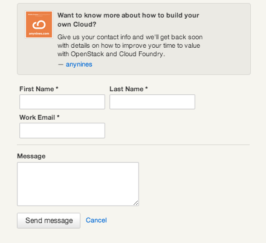
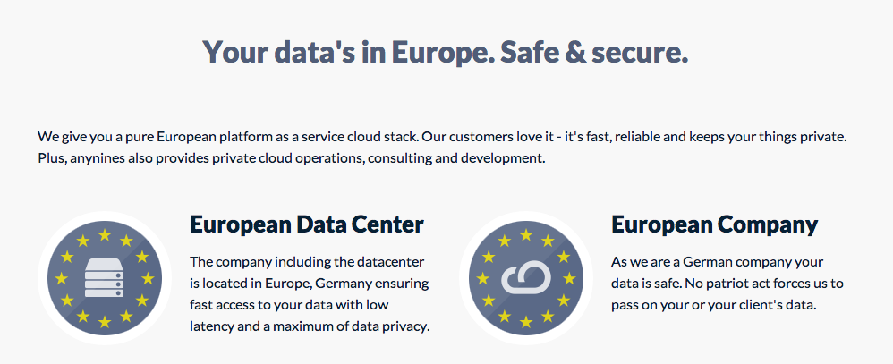

= Help Page
Floor Drees <fdrees@anynines.com>
v1.0, April., 2014: First version
:language: html
:imagesdir: ../../images
:iconsdir: ../../images/icons
:linkattrs:
:sectlinks: 
:icons: font
:toc: right
:keywords: documentation, team, anynines, help
:description: A series of notes and references from our + 
documentation team. To give you a better understanding of our platform, we've gathered together some links, documents, talks and references that explain things a bit better.

This journey begins...

== Purpose

Here's a series of notes and references from our documentation team. To give you a better understanding of our platform, we've gathered together some links, documents, talks and references that explain things a bit better.

== We'd Love To Hear From You

== Technical Slideshows

+++<table><tr><td><iframe src="http://www.slideshare.net/slideshow/embed_code/28514344" width="427" height="356" frameborder="0" marginwidth="0" marginheight="0" scrolling="no" style="border:1px solid #CCC; border-width:1px 1px 0; margin-bottom:5px; max-width: 100%;" allowfullscreen> </iframe> 
 <strong> <a href="https://www.slideshare.net/cdavisafc/cloud-foundry-technical-overview" title="Cloud Foundry Technical Overview" target="_blank">Cloud Foundry Technical Overview</a> </strong> from <strong><a href="http://www.slideshare.net/cdavisafc" target="_blank">Cornelia Davis</a></strong> 
</td>
<td><iframe src="http://www.slideshare.net/slideshow/embed_code/30103333" width="427" height="356" frameborder="0" marginwidth="0" marginheight="0" scrolling="no" style="border:1px solid #CCC; border-width:1px 1px 0; margin-bottom:5px; max-width: 100%;" allowfullscreen> </iframe> 
 <strong> <a href="https://www.slideshare.net/platformcf/pivotal-cf-the-platform-for-building-great-software" title="The Platform for Building Great Software" target="_blank">The Platform for Building Great Software</a> </strong> from <strong><a href="http://www.slideshare.net/platformcf" target="_blank">Platform CF</a></strong>
</td></tr></table>+++

== Our Team

We'd like to introduce you to our team  icon:heart[size=1x]. These clever clogs turn the wheels that make your app crank out the goods ! Meet us here http://www.anynines.com/team[Our Team].

== Contact Us

You can contact our author {author} at {email}. {firstname} loves to hear from other chroniclers.

P.S. And yes, what better name describes the foundation of our enterprise than {firstname} ?

 

